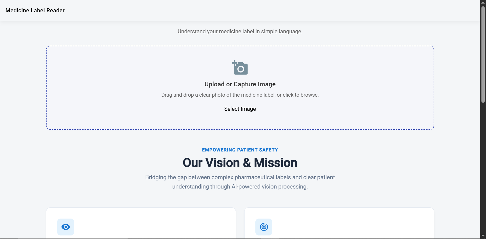
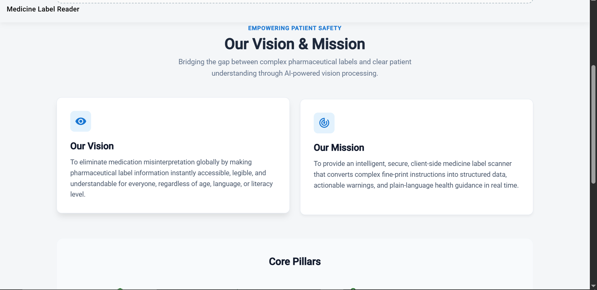
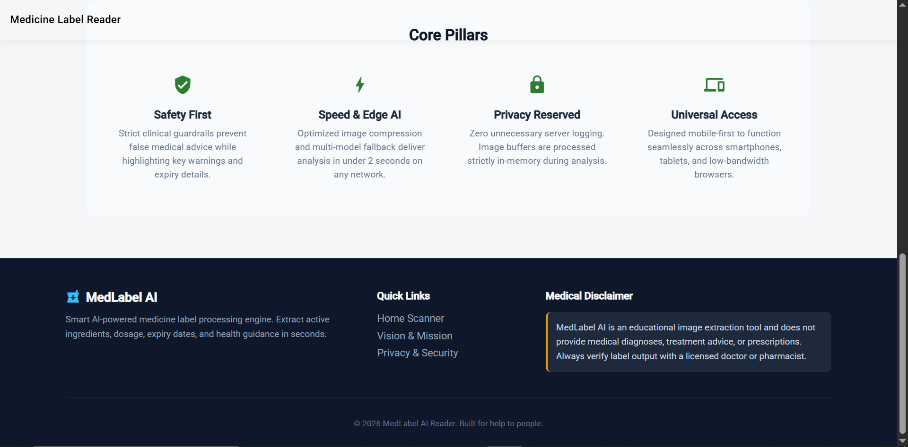
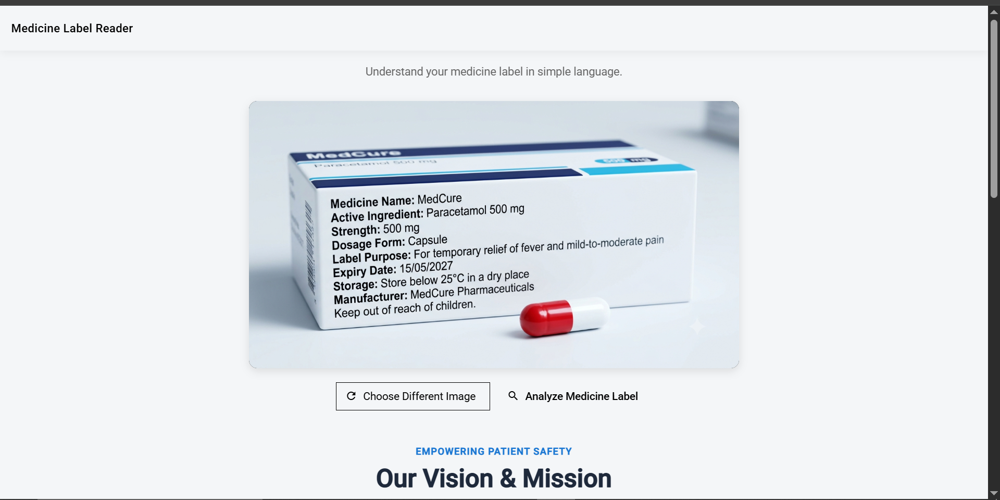
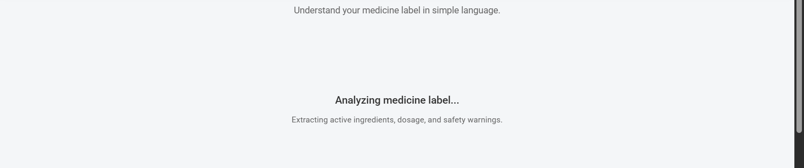
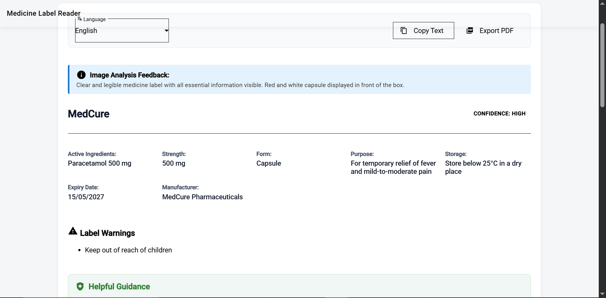
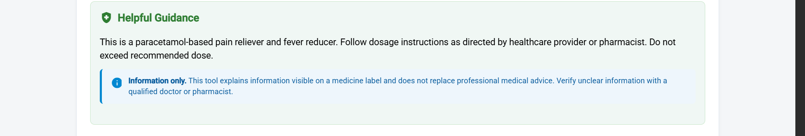

# Medicine Label Reader

Medicine Label Reader is an AI-powered web application that analyzes medicine-label images using **Claude AI**. It extracts visible medicine information such as medicine name, active ingredients, strength, dosage form, expiry date, storage instructions, warnings, and manufacturer in a clear and structured format.

> **Important:** This project is intended for informational medicine-label interpretation only. It does not provide medical diagnosis, prescriptions, dosage recommendations, or instructions to start, stop, or change medication.

---

## Project Output

### Home Page









### Medicine Image Upload



### Extracting Medicine Information



### Final Application Output






---

## Features

- Upload medicine-label images
- Preview selected medicine images
- Analyze images using Claude AI
- Extract visible medicine information
- Medicine name extraction
- Active ingredient extraction
- Strength identification
- Dosage form identification
- Expiry date extraction
- Storage information extraction
- Warning extraction
- Manufacturer information
- AI confidence level
- Safe handling of unclear information
- Responsive UI
- Secure server-side API integration
- Environment-based API key management
- Vercel deployment support

---

## Technology Stack

| Technology | Purpose |
|---|---|
| Angular 21 | Frontend |
| TypeScript | Application development |
| Angular Material | UI components |
| SCSS | Styling |
| Claude AI | Medicine-label image analysis |
| Vercel | Serverless API and deployment |
| GitHub | Version control |

---

# Project Architecture

```text
                    Medicine Label Image
                            |
                            v
                 +----------------------+
                 |   Angular Frontend   |
                 | Medicine Label Reader|
                 +----------+-----------+
                            |
                            | POST /api/analyze
                            v
                 +----------------------+
                 | Vercel Serverless API|
                 |      analyze.ts      |
                 +----------+-----------+
                            |
                            | CLAUDE_API_KEY
                            v
                 +----------------------+
                 |       Claude AI      |
                 |   Image Analysis     |
                 +----------+-----------+
                            |
                            | Structured JSON
                            v
                 +----------------------+
                 |   Angular Result UI  |
                 +----------------------+
